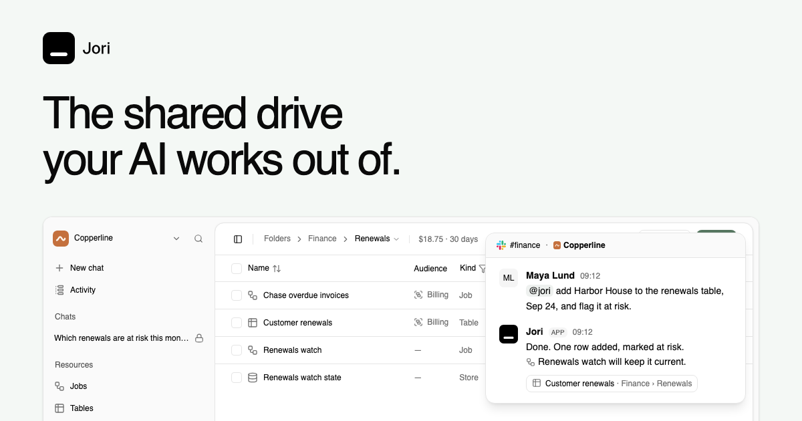

# Jori

The shared drive your AI works out of. Describe a recurring job and choose
when it runs. Jori keeps the job beside the tables and files it uses, in
folders your team shares. Review each run and see AI spending by folder.

[Explore the demo](https://usejori.com/#demo) ·
[Pricing](https://usejori.com/pricing) ·
[Join the waitlist](https://usejori.com/#waitlist)

## Status

Jori is early. We're looking for our first paid pilot teams and will help
set up one recurring job with each team. Hosted access is by invitation.
The demo uses example data and scripted AI replies.

Self-hosting is not yet documented for independent setup. The
[deployment guide](guides/deployment.md) covers our own environments.

## Map

- [AGENTS.md](AGENTS.md): how the repository is worked on, and the rules the
  checks enforce.
- [guides/](guides): deployment, UI, and integrations.
- [CONTRIBUTING.md](CONTRIBUTING.md): pull requests aren't open yet, and how
  contributing will work when they are.
- [CLA.md](CLA.md): the contributor license agreement.
- [SECURITY.md](SECURITY.md): how to report a vulnerability.
- [NOTICE.md](NOTICE.md): third-party notices.
- [LICENSE](LICENSE): the GNU Affero General Public License, version 3.
- [Trust](https://usejori.com/trust), [terms](https://usejori.com/terms),
  [privacy](https://usejori.com/privacy), and the
  [DPA](https://usejori.com/dpa) for the hosted service.

## License

Copyright (c) 2026 Vedin Labs AB.

Jori, including its agent prompts and skills, is free software: you can
redistribute it and modify it under the terms of the GNU Affero General
Public License as published by the Free Software Foundation, either
version 3 of the License, or (at your option) any later version. See
[LICENSE](LICENSE). The Jori name and logo are not covered by the license.
